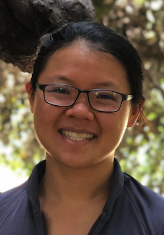

I am an Associate Professor in the Department of Epidemiology and Biostatistics at the University of California, San Francisco and the UCSF-UC Berkeley Joint Program in Computational Precision Health.

As a principal investigator at the [UCSF-Stanford Center of Excellence in Regulatory Science and Innovation (CERSI)](https://pharm.ucsf.edu/cersi), I also collaborate closely with researchers from the US Food and Drug Administration to develop methods that improve the safety, reliability, and interpretability of artificial intelligence (AI)/machine learning (ML) algorithms in healthcare. Recent projects include diagnosing performance drops in AI/ML algorithms, using Large Language Models (LLMs) for scaling regulatory science, and understanding the statistical limits of LLM-as-a-judge for evaluating generative AI systems.

I am also the data science lead on the [PROSPECT team](https://zsfg-prospect.github.io/), the digital innovation taskforce for the Zuckerberg San Francisco General Hospital. Recent projects by the PROSPECT team include the deployment of a readmission risk prediction model and the development of an LLM pipeline to summarize patient charts.

I completed my Ph.D. in Biostatistics under [Noah Simon](https://faculty.washington.edu/nrsimon/) and [Erick Matsen](https://matsen.fhcrc.org/) at the University of Washington.
Before that, I studied computer science at Stanford and was a software engineer at [Coursera](https://www.coursera.org/).

[CV](cv.pdf) / [GitHub](https://github.com/jjfeng) / [Google Scholar](https://scholar.google.com/citations?user=rKCO-dwAAAAJ&hl=en) / [LinkedIn](https://www.linkedin.com/in/fengjean/) / [Twitter](https://twitter.com/Jean_J_Feng)  

Email:
<noscript>Sorry, you need Javascript on to email.</noscript>

## News
- **Feb 2026**: Congrats to the incredible Hanyang Li and Xiao He and the rest of the team for publishing in Nature Digital Medicine! This [important work](https://doi.org/10.1038/s41746-026-02353-7) highlights how AI can scale regulatory science for medical devices, quite accurately. But more importantly, this paper showcases how AI can be used to serve patients, regulators, researchers, and even device vendors. All the code is public too!
- **Jan 2026**: Our work on understanding the [statistical limits of LLM-as-a-judge](https://arxiv.org/abs/2505.21972) was accepted at AISTATS 2026! Congratulations to the team, especially to Patrick for leading the effort! And special thanks to Yifan Mai for sharing data from HELM for this project! Excited for Morocco!
- **Dec 2025**: Our work on [developing an LLM-based summarization and information extraction engine for the social workers at the SF safety net hospital](https://arxiv.org/abs/2508.08504) was accepted at AAAI 2026! Incredible work by Avni Kothari and Patrick Vossler, and deep gratitude to the social workers for their engagement in this work! See you all in Singapore!
- **Dec 2025**: Our work on [learning concept bottleneck with LLM priors in a statistically principled framework](https://neurips.cc/virtual/2025/loc/san-diego/poster/116029) was accepted at NeurIPS! Thank you to my wonderful coauthors Yan Shuo Tan, Chandan Singh, Avni Kothari, and Luke Zier!
- **Jun 2025**: Our work on [testing for subgroup-level performance decay of ML algorithms](https://icml.cc/virtual/2025/poster/45315) was accepted at ICML! Congrats Harvineet and the rest of the team!
- **Jan 2025**: We just published a review in NEJM AI on real-world clinical AI monitoring systems, which was a wonderful collaboration between Romain Pirracchio, Fan Xia, and Karandeep Singh. TL;DR [Not all clinical AI monitoring systems are created equal!](https://ai.nejm.org/doi/full/10.1056/AIra2400657)
- **Oct 2024**: Our lab has two NeurIPS workshop papers accepted! One on [explaining performance differences of ML algorithms across domains](https://arxiv.org/abs/2402.14254) and one on [leveraging LLMs as Bayesian priors to fit Concept Bottleneck Models](https://arxiv.org/abs/2410.15555).
- **Sep 2024**: Our work on [explaining performance differences of ML algorithms across domains](https://arxiv.org/abs/2402.14254) was accepted at NeurIPS! Congratulations Harvineet and the rest of the team!
- **June 2024**: Congratulations Harvineet Singh and Avni Kothari for acceptances for oral presentations at the AMIA Annual Symposium!
- **Mar 2024**: More exciting news! Our proposal for supplemental research funding on studying robustness of LLMs in healthcare was approved for PCORI funding! The project will extend our current work on creating diagnostic tools for ML-based clinical decision support systems, but now encompassing LLMs.
- **Feb 2024**: I presented our lab's work on QA and QI for ML-based medical devices at the inaugural AI Regulatory and International Symposium, hosted by the US FDA and Korea MFDS and attended by regulatory bodies from over twenty countries! It was an honor to share our work with regulators and industry members, and energizing to see academia, regulators, and industry all come together to shape regulatory policies for AI in healthcare.
- **Jan 2024**: What a month! Our lab has one paper accepted at the Conference on Causal Learning and Reasoning (CLeaR): ["Monitoring the performance of machine learning algorithms that induce feedback loops: what is the causal estimand"](https://arxiv.org/abs/2311.11463). We also have two papers accepted at AISTAT: [Is this model reliable for everyone? Testing for strong calibration](https://arxiv.org/abs/2307.15247) (**oral!**) and [Monitoring machine learning-based risk prediction algorithms in the presence of performativity](https://arxiv.org/abs/2211.09781).
- **Nov 2023**: Our lab has two papers accepted at the [Regulatable AI Workshop at NeurIPS](https://regulatableml.github.io/)! One on a [causal monitoring framework for ML-based medical devices](https://arxiv.org/abs/2311.11463) (selected for oral) and one on sample size calculations for model fairness audits.
- **Sep 2023**: Avni Kothari has joined our lab as a data scientist! We're growing!
- **Apr 2023**: Harvineet Singh will be joining as a postdoctoral researcher in the lab in July! We're really excited to have him!
- **Nov 2022**: Big news! Our grant proposal on developing diagnostic tools for ML algorithms has been funded by PCORI! See the project description [here](https://www.pcori.org/research-results/2022/diagnostic-tools-quality-improvement-machine-learning-based-clinical-decision-support-systems).
- **Nov 2022**: Thank you to SER digital for the opportunity to discuss the intersection of ML and epidemiology! Slides are [here](https://www.jeanfeng.com/ser_talk.pdf).
- **May 2022**: Our paper "Clinical Artificial Intelligence Quality Improvement: Towards Continual Monitoring and Updating of AI Algorithms in Healthcare" is published in Nature Digital Medicine! Check it out [here](https://www.nature.com/articles/s41746-022-00611-y).
- **Apr 2022**: I gave a talk at the Biometrics Journal Club on the statistical considerations when regulating ML-based medical devices that evolve over time. The talk is based on our 2021 Biometrics paper ["Approval policies for modifications to machine learning-based software as a medical device: A study of bio-creep"](https://doi.org/10.1111/biom.13379). Slides are [here](https://www.jeanfeng.com/biometrics_talk.pdf).
- **Oct 2021**: [Romain Pirracchio](https://www.romainpirracchio.org/) and I have received a grant to extend our original [UCSF-Stanford CERSI](https://pharm.ucsf.edu/cersi) proposal "Safe algorithmic change protocols for modifications to AI/ML-based Software as a Medical Device". This new project will look at the impacts of integrating real-world data. We're excited to continue working with our CDRH collaborators Berkman Sahiner and Alexej Gossmann!
- **Sep 2021**: Our work on [online recalibration and revision of clinical prediction models](https://ww2.amstat.org/meetings/biop/2021/onlineprogram/AbstractDetails.cfm?AbstractID=302405) was presented at BIOP 2021.
- **Aug 2021**: I gave a talk as part of the ASA Statistical Learning and Data Science webinar series on deep learning! Check out the slides [here](https://www.jeanfeng.com/easier_slds.pdf).
- **Sep 2020**: [Romain Pirracchio](https://www.romainpirracchio.org/) and I have received a grant from the [UCSF-Stanford CERSI program](https://pharm.ucsf.edu/cersi) for our proposal "Safe algorithmic change protocols for modifications to AI/ML-based Software as a Medical Device". This grant will be done in close collaboration with Berkman Sahiner and Alexej Gossmann from the US FDA.

## Tutorials and Short Courses

- **June 2022**: I co-taught the [Columbia ML bootcamp](https://www.publichealth.columbia.edu/research/precision-prevention/machine-learning-boot-camp-analyzing-biomedical-and-health-data) with [Noah Simon](https://faculty.washington.edu/nrsimon/) and [Cody Chiuzan](https://www.publichealth.columbia.edu/people/our-faculty/cc3780) for the third time!
- **Aug 2021**: I joined forces again with [Noah Simon](https://faculty.washington.edu/nrsimon/) and [Cody Chiuzan](https://www.publichealth.columbia.edu/people/our-faculty/cc3780) to teach a [short course](https://www.publichealth.columbia.edu/research/precision-prevention/machine-learning-boot-camp-analyzing-biomedical-and-health-data) on machine learning for biomedical and health data.
- **Nov 2020**: I taught a [short course](https://www.biostat.washington.edu/news/calendar/symposium) on supervised statistical learning with [Ali Shojaie](http://faculty.washington.edu/ashojaie/) on November 15th at the 6th Seattle Symposium in Biostatistics. ([Slides](teaching/Seattle_Symposium_ShortCourse2020_ML.pdf))
- **Aug 2020**: I taught a [short course](https://www.publichealth.columbia.edu/research/precision-prevention/machine-learning-boot-camp-analyzing-biomedical-and-health-data) on machine learning for biomedical and health data with [Noah Simon](https://faculty.washington.edu/nrsimon/) and [Cody Chiuzan](https://www.publichealth.columbia.edu/people/our-faculty/cc3780).
